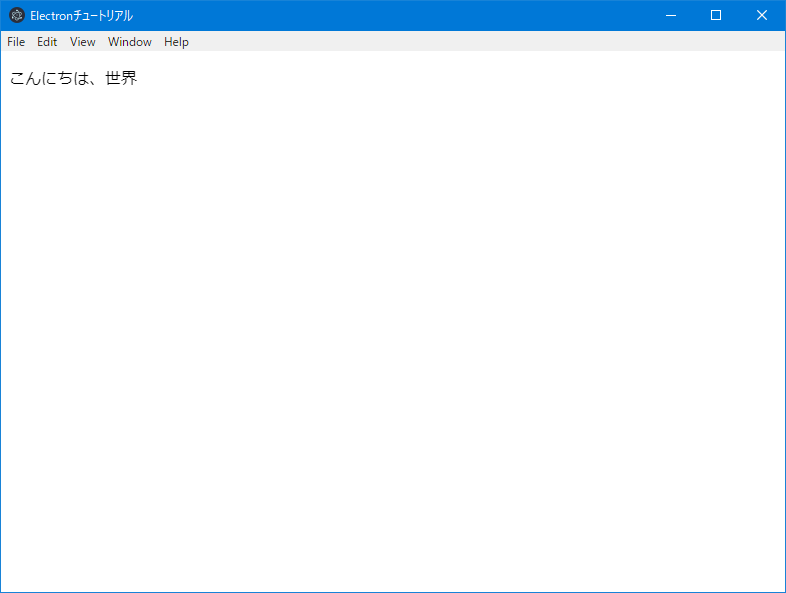

# Electron & React & Redux & TypeScript アプリ作成ワークショップ 2日目

前回は、npm プロジェクトと主要なライブラリのインストールを行いました。

今回は、各ツールの定義ファイルの作成と、Electronアプリの最小限の構成で、一応動作するところまで作ります。

## TypeScript コンパイラ・オプションファイルの作成

TypeScriptのコンパイル・オプションは多数あるので、コンパイル・コマンドで引数を指定するよりも、ファイルで定義したほうが効率的です。

ファイル名は、`tsconfig.json`とします。

ファイルを一から作ることもできますが、下記コマンドで作成することもでき、オプションがコメントで全て記述されているので、オプションの on/off が楽です。

> 通常JSONファイルはコメントの記述はできないのですが、このJSONファイルは特別なルールが適用されるようです。

```bash
$ ./node_modules/.bin/tsc --init
```

いくつかのコメントアウトを外し、下記になるようにしてください。

また、"include"属性も追加します。これは、コンパイル対象のファイルを指定するものです。

```json
{
  "compilerOptions": {
    "target": "es6",
    "module": "commonjs",
    "jsx": "react",
    "outDir": "./dist",
    "strict": true,
    "esModuleInterop": true,
    "sourceRoot": "./tsx",
    "inlineSourceMap": true,
    "inlineSources": true
  },
  "include": [
    "./ts/**/*"
  ]
}
```

> パスのワイルドカードについて
> * `/**/` サブディレクトリを再帰的にマッチ
> * `*` 0個以上の文字列にマッチ
> * `?` 1個の文字列にマッチ

## tslint 設定ファイル の作成

tslint は設定したコーディング・ルールに従って、コンパイラが行う構文チェックより厳しいチェックを行います。

例えば、
* 文字列リテラルのシングルクォーテーションの仕様を強制する
* 末尾のセミコロンを強制する
* インデントの数のチェック
* 比較演算子に2個のイコールを禁止する(3個イコールを使用する)
* インターフェースやクラス名をキャメル型に強制する

などがあります。

> ルール  
> 公式: [TSLint core rules](https://palantir.github.io/tslint/rules/)  
> 非公式(日本語): [TSLint v5.7.0 で指定できる全 rules をまとめた - Corredor](http://neos21.hatenablog.com/entry/2017/10/25/080000)

下記コマンドで、推奨設定での tslint 設定ファイル`tslint.json`が作成されます。

```bash
$ ./node_modules/.bin/tslint.cmd --init
```

ここでは推奨設定に加えて、文字列リテラルには、シングルクォーテーションを使用するが、JSXの属性ではダブルクォーテーションとする、というルールを適用することとします。

> 推奨設定の内容: [tslint/recommended.ts at master · palantir/tslint](https://github.com/palantir/tslint/blob/master/src/configs/recommended.ts)  
> 推奨設定は、airbnb という企業が設計し、オープンソースとして公開しているルールとなっている
> [Javascript-style-guide](http://mitsuruog.github.io/javascript-style-guide/)  
> 結構厳し目ですが、特に問題ない限りこれに従うと良いです。

tslint.json

```json
{
    "defaultSeverity": "error",
    "extends": [
        "tslint:recommended"
    ],
    "jsRules": {},
    "rules": {
        "quotemark": [true, "single", "jsx-double"]
    },
    "rulesDirectory": []
}
```

## webpack.config.js の作成

webpack の動作設定を行います。`webpack.config.js`の名前で空ファイルを作成し、下記内容を記述します。

```javascript
const path = require('path');

module.exports = {
const path = require('path');

module.exports = {
    // node.js で動作することを指定する
    target: 'node',
    // 起点となるファイル
    entry: './ts/index.tsx',
    // webpack watch したときに差分ビルドができる
    cache: true,
    // development は、 source map file を作成、再ビルド時間の短縮などの設定となる
    // production は、コードの圧縮やモジュールの最適化が行われる設定となる
    mode: 'development', // "production" | "development" | "none"
    // ソースマップのタイプ
    devtool: 'source-map',
    // 出力先設定 __dirname は node でのカレントディレクトリのパスが格納される変数
    output: {
        path: path.join(__dirname, 'dist'),
        filename: 'index.js'
    },
    // ファイルタイプ毎の処理を記述する
    module: {
        rules: [{
            // 正規表現で指定する
            // 拡張子 .ts または .tsx の場合
            test: /\.tsx?$/,
            // ローダーの指定
            // TypeScript をコンパイルする
            use: 'ts-loader'
        }, {
            // 拡張子 .ts または .tsx の場合
            test: /\.tsx?$/,
            // 事前処理
            enforce: 'pre',
            // TypeScript をコードチェックする
            loader: 'tslint-loader',
            // 定義ファイル
            options: {
                configFile: './tslint.json',
                // airbnb というJavaScriptスタイルガイドに従うには下記が必要
                typeCheck: true,
            },
        }],
    },
   // 処理対象のファイルを記載する
    resolve: {
        extensions: [
            '.ts',
            '.tsx',
            '.js', // node_modulesのライブラリ読み込みに必要
        ]
    },
};
```

## HTML の作成

UIとなるHTMLファイルを作成します。

Reactでは、ほとんどの要素を動的に生成するので、HTMLファイルは非常に簡単なものになります。

ファイル名を`index.html`とします。

index.html

```html
<!DOCTYPE html>
<html lang="en">
<head>
    <meta charset="UTF-8">
    <meta name="viewport" content="width=device-width, initial-scale=1.0">
    <title>Electronチュートリアル</title>
</head>
<body>
    <div id="contents"></div>
    <script src="dist/index.js"></script>
</body>
</html>
```

## main.js の作成

Electronは、1つの main プロセスと 1つ以上の render　プロセスの2種類のプロセスで動作します。

main プロセスは、Electron 自体と render プロセスの管理を行うものです。Electronアプリを起動したときには、まず main プロセスが動作し、その中で render プロセスを起動する仕組みとなっています。

render プロセスは、ブラウザエンジンを持っていて、ブラウザアプリの動作を担当します。

main.js にはメインプロセスのプログラムを書きます。

> これも TypeScript で書いて webpack で JavaScript に変換することもできますが、今回はコード量がそれほど多くはないので、JavaScript で書きます。

main.js

```js
const {
    app,
    BrowserWindow
} = require('electron')

// レンダープロセスとなるブラウザ・ウィンドウのオブジェクト。
// オブジェクトが破棄されると、プロセスも終了するので、グローバルオブジェクトとする。
let win

function createWindow() {
    // ブラウザウィンドウの作成
    win = new BrowserWindow({
        width: 800,
        height: 600
    })
    // index.html をロードする
    win.loadFile('index.html')
    // 起動オプションに、 "--debug"があれば開発者ツールを起動する
    if (process.argv.find((arg) => arg === '--debug')) {
        win.webContents.openDevTools()
    }
    // ブラウザウィンドウを閉じたときのイベントハンドラ
    win.on('closed', () => {
        // 閉じたウィンドウオブジェクトにはアクセスできない
        win = null
    })
}

// このメソッドは、Electronが初期化を終了し、
// ブラウザウィンドウを作成する準備ができたら呼び出される。
// 一部のAPIは、このイベントが発生した後にのみ使用できる。
app.on('ready', createWindow)

// 全てのウィンドウオブジェクトが閉じたときのイベントハンドラ
app.on('window-all-closed', () => {
    // macOSでは、アプリケーションとそのメニューバーがCmd + Qで
    // 明示的に終了するまでアクティブになるのが一般的なため、
    // メインプロセスは終了させない
    if (process.platform !== 'darwin') {
        app.quit()
    }
});

app.on('activate', () => {
    // MacOSでは、ドックアイコンがクリックされ、
    // 他のウィンドウが開いていないときに、アプリケーションでウィンドウを
    // 再作成するのが一般的です。
    if (win === null) {
        createWindow()
    }
});
```

## コンパイル確認用スクリプトの記述

webpack でコンパイルができるか、確認します。

そのために、TypeScript のファイル`index.tsx`を１つ作成します。

```tsx
import React from 'react';
import ReactDom from 'react-dom';

const container = document.getElementById('contents');

ReactDom.render(
    <p>こんにちは、世界</p>,
    container,
);
```

コード中にいきなり文字列でもなくHTMLタグがありますが、これは JSX 記法と言われるもので、DOM Elementオブジェクト（正確には、DOM Element をラッピングした React.HTMLElement オブジェクト ）を作成するものです。

> 参考: [JSXの基本 – React入門 - to-R Media](https://www.to-r.net/media/react-tutorial04/)

TypeScript でこれを利用するためには、`tsconfig.json`で`"jsx": "react"`(Reactを利用する場合)とし、ソースのファイルの拡張子を`.tsx`とする必要があります。

また、当然この記法は JavaScript としてブラウザが認識してくれないので、JavaScript に変換する必要がありますが、TypeScript コンパイラにはその機能もあるので、別途ツールを用意するなどの必要はありません。

##　コンパイルの確認

下記コマンドを実行して、コンパイルを実行します。

```bash
$ ./node_modules/.bin/webpack
```

dist ディレクトリが作成されその中に、`index.js`と`index.js.map`ができていれば成功です。

Electron を起動して確認してみましょう。

```bash
$ ./node_modules/.bin/electron ./
```

”こんにちは、世界”が出てきたら成功です。



## npm script を利用する

いちいち`./node_modules/.bin`とか打つのが面倒なので、npm script に書きます。

```json
{
  "scripts": {
    "build": "webpack",
    "start": "electron ./"
  },
}
```

npm script は下記のように実行します。

```bash
$ npm run build
```

npm script は、`"コマンド名": "シェルコマンド"`というように書きますが、`node_modules/.bin`にはパスが通った状態で実行するので、それを打たなくても良いです。

また、下記コマンドは規定のコマンド名なので、`run` が必要ないです。

* start
* restart
* stop
* test

```bash
$ npm start
```

> 参考: [npm scriptsを使おう - Qiita](https://qiita.com/liply/items/cccc6a7b703c1d3ab04f)

## 次回

コンパイルの環境が整いましたので、次回は、React-Redux を使ったフレームワークのコードを書いていきます。
