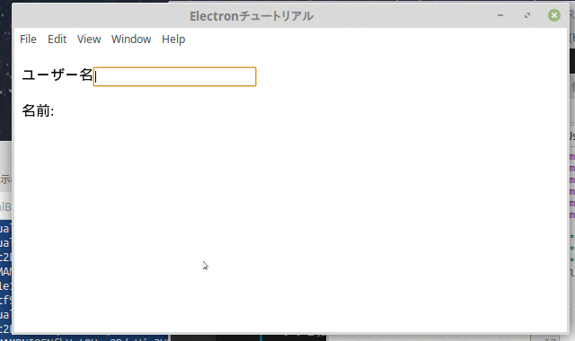

# Electron & React & Redux & TypeScript アプリ作成ワークショップ 3日目

前回までに、 webpack を使ったビルドができるようになりました。

今回は、 React-Redux を使ったSkeletonコード的なものを書いていきます。React の基本的な書き方と Redux のデータフローを実感するために、簡単な下記のような画面を作成します。

テキストボックスに値を入れると、その下に同じものを表示する、というものです。



実装には入間に、Redux について触れておきます。

## Redux のデータフロー

> 参考: [Redux入門【ダイジェスト版】10分で理解するReduxの基礎](https://qiita.com/kiita312/items/49a1f03445b19cf407b7)

Redux はデータとその流れを制御するフレームワークです。

Redux には、いくつかのモジュールに分かれていて、それをカスタマイズしていくことになります。


* view

    UIをレンダリングするモジュールで、Redux には含まれません。

    Reactで記述して、Redux での Store の変更を React-Redux で受け取ります。

    Component とは、 React で書かれたWebのパーツです。Component は、他の Component を参照することもできます。

    Container とは、 React-Redux で store に連携された Component のことで、アプリ内に複数設けることができます。UIのトップレベルの Component となります。
    
    Container はネストできますが、値は必ず store から引き渡されるため、 Container 間のデータの受け渡しはできません。

* action

    view で操作等のイベントで、 stroe のデータを更新する必要がある場合、その更新に必要なデータを格納したオブジェクトです。

* action creator

    action を生成して返すための関数です。引数によって、アクションの値を変えたり、アクションの種類を変えたりします。

    ファイルからデータを取得したり、web api から値を取得する場合など、非同期処理が必要になる場合には、 action creator でその対応をします。（一般的には・・・ケース・バイ・ケースもあり得る）

* reducer

    view から dispach コマンドによって、アクションを送られ、その内容に応じてデータの更新を行うモジュールです。

* store

    データ(state)を保持するモジュール。シングルトン・オブジェクトとなる。

* state

    データそのものです。これもシングルトンのオブジェクトですが、複数の state (ここではchild_state と呼びます) を束ねたものにする場合が多いです。

## child_state の作成

`ts/states`ディレクトリを作成し、`IUser.ts`ファイルを作成して、child_state となるデータの構造体をインターフェースとして定義します。

今回は非常に簡単なモデルにします。

また、Reduxではステートの初期値が必要になるので、それもここで宣言しておきます。

ts/states/IUser.ts

```ts
export default interface IUser {
    name: string;
}

export const initUser: IUser = {
    name: '',
};
```

## component の作成

画面に表示するための部品となる、コンポーネントを作成します。

できれば、コピペではなくタイプして入力してください。入力支援の効果が体験できます。

### ラベル付きテキストボックスの作成

まずは、汎用的なラベル付きのテキストボックスのコンポーネントを作成します。
`ts/components`ディレクトリを作成し、`TextBox.tsx`ファイルを作成します。

ts/components/TextBox.tsx

```tsx
import React from 'react'; // --(a);

// 親コンポーネントから渡されるプロパティを定義する // --(b)
interface IProps {
    // ラベル文字列
    label: string;
    // テキストボックスのタイプ
    type: 'text' | `password`;
    // テキストボックスに表示する値
    value: string;
    // 値の確定時にその値を親プロパティが取得するためにコールバック関数を提供する
    onChnageText: (value: string) => void;
}

/**
 * ラベル付きのテキストボックスを提供する
 */
export class TextBox extends React.Component<IProps, {}> { // --(c)
    // DOMエレメントをレンダリングする
    public render() {
        // ラベルが設定されていない場合は、 label を出力しない
        const label = (!!this.props.label) ?
            <label>{this.props.label}</label> :
            null; // --(d)
        return (
            <span>
                {/* {} で囲むと JavaScript のコードが書ける */}
                {label /* --(e) */}
                <input name="username" type={this.props.type} value={this.props.value}
                    onChange={this.onChnageText} /> {/* --(f) */}
            </span>
        );
    }
    // 値を変更したら、store.dispatch で action を reducer に渡して、state を更新する。
    // state が更新されたら component の prop が更新され、再レンダリングされ、テキストボックスの内容が変更される。
    private onChnageText = (e: React.ChangeEvent<HTMLInputElement>) => { // --(g)
        this.props.onChnageText(e.target.value);
    }

}
```

コードの説明です。

* (a): react ライブラリの参照宣言です。
* (b): このコンポーネントの公開プロパティです。これを利用する親コンポーネントから渡される値の定義を宣言します。
* (c): クラスとしてコンポーネントを定義します。ジェネリック型引数の１番目は、プロパティの型、２番めはローカルステートの型となります。ローカルステートは、Redux を利用する場合あまり使用しません。
* (d): 動的なエレメントを変数に割当てます。`label`オブジェクトは、`JSX.Element | null`という複合型になります。
* (e): (d)で変数にセットしたエレメントをここに展開します。`label`が`null`の場合は、何も出力されません。
* (f): HTML の input を定義します。属性は "" でくくるが、動的な値の場合は、{} でくくります。  
ほとんどの HTML の属性が利用できますが、class など、JavaScript の予約語となっているものは利用できないので、className と属性名が変わるものもあります。
* (g): input の value は、外部から渡された value プロパティを参照しています。それは親のコンポーネントから渡されるものです。そのため、テキストボックスの入力値で、親のプロパティの値を更新しないと、値の変更がされず、値が入力できません。  
    Redux を利用する場合、reducer を通して stroe を更新し、その変更をコンポーネントで受ける事となります。  
    イベントハンドラの引数は、イベントが発火された DOM Element となります。

### ユーザー名入力画面の作成

`UserForm.tsx`ファイルを作成します。

このコンポーネントは、後ほど react-redux で　store と連携させます。

そうすることで、store が変更したときに、このコンポーネントのプロパティの変更と再レンダリングを自動化します。

```jsx
import React from 'react';
import { IUser } from '../states/IUser';
import { TextBox } from './TextBox';

/**
 * ユーザー名を入力して表示する
 */
class UserForm extends React.Component<IUser, {}> { // --(a)
    public render() {
        return (
            <div>
                <p>
                    <TextBox label="ユーザー名" type="text" value={this.props.name}
                        onChnageText={this.onChangeText} /> {/* --(b) */}
                </p>
                <p>名前: {this.props.name}</p>
            </div>
        );
    }

    private onChangeText = (value: string) => { // --(c)
        // action や store ができてから書く
    }
}
```

コードの説明です。

* (a): export としないのは、後ほど react-redux で state にバインドするためです。
* (b): 上で作ったコンポーネントを利用します。このように、作成したコンポーネントを HTML 要素のように利用することができます。
* (c): 値が変更されたときのコールバック関数を定義します。action を store の dispatch で reducer に送るコードを書きますが、まだそれらを定義していないので、後から書きます。

## action と action creator の作成

テキストボックスの内容を変更されたときのアクションを作っていきます。

`ts/actions`ディレクトリを作成し、`UserNameEvents.ts`ファイルを作成します。

UserNameEvents.ts

```ts
import Redux from 'redux';
import {v4 as UUID} from 'uuid'; // -- (a)

/**
 * ユーザー名を変更するアクション・タイプ
 */
export const CHANGE_USER_NAME = UUID(); // -- (b)

/**
 * ユーザー名を変更するアクション
 */
export interface IChangeUserNameAction extends Redux.Action { // --(c)
    /** 変更する名前の文字列 */
    name: string;
}

/**
 * ユーザー名変更アクション・クリエイター
 * @param name 変更する名前の文字列
 * @returns ユーザー名変更アクション
 */
export const createChangeUserNameAction: Redux.ActionCreator<IChangeUserNameAction> = (name: string) => { // --(d)
    return {
        name,
        type: CHANGE_USER_NAME,
    };
};
```

アプリ全体で一意なアクション・タイプが必要なので、ここでは UUID を利用しています。

ライブラリの追加が必要です。

```bash
$ npm install --save uuid && npm install --save-dev @types/uuid
```

コードの説明です。

* (a): UUID ライブラリのインポート宣言です。ここでは、その中の `v4`関数を`UUID`という名前のエイリアスを設定しています。
* (b): アクションには、必ず `type` （文字列）が必要です。また、アクションごとにアプリ内で一意である必要があります。  
そのため、ここでは UUID で文字列を振ることにしています。
* (c): アクションの型を定義したインターフェースです。 `Redux.Action`を継承することで、必須である `type` プロパティが付与されます。
* (d): アクションを生成し返す関数です。GoF的にいうとファクトリーメソッドです。  
`name,` とだけある行は、`name: name,`と同じです。

## reducer を作成する

view から action を渡されて、store の値を変更する reducer を作成します。

`ts/reducers`ディレクトリを作成し、`UserReducer.ts`を作成します。

UserReducer.ts

```ts
import Clone from 'clone';
import Redux from 'redux';

import { CHANGE_USER_NAME, IChangeUserNameAction } from '../actions/UserEvents';
import IUser, { initUser } from '../states/IUser';

export const UserReducer: Redux.Reducer<IUser> = (childState = initUser, action) => { // --(a)
    let newChildState: IUser = childState; // --(b)
    switch (action.type) {
        case CHANGE_USER_NAME: // --(c)
            {
                newChildState = Clone(childState); // --(d)
                newChildState.name = (action as IChangeUserNameAction).name; // --(e)
            }
            break;
    }
    return newChildState;
};
```

新しいライブラリが登場しています。オブジェクトのクローンを行うものです。

```bash
$ npm install --save clone && npm install --save-dev @types/clone
```

コードの説明をします。

* (a): 関数で Reducer を定義します。Reducer は、 child_state ごとに作成し、引数としてその child_state と action を渡します。   
    ジェネリック型引数で、 child_state の型を指定しています。 
    アプリが開始してはじめに呼ばれるときに、child_state は、undefined が渡されます。そのため、初期値として`initUser`を渡しています。
* (b): この関数は必ず ジェネリック型で指定された child_state オブジェクトを返さないといけないので、ここで参照しています。
* (c): アクションタイプ ごとに処理を書きます。アクションは複数あるので、その種類を判断するのに、 type で判断しています。`switch`を利用していますが、アクションが増えてくると管理しづらくなるので、これは後ほど改善することとします。
* (d): ここは重要です。対象のアクションだった場合、child_state を変更します。注意しなければならないのは、引数の child_state のオブジェクト内の値を変えても、child_state が変更されたとみなされないため、view に変更通知が行きません。  
    つまり、 `state !== new State`である必要があります。  
    ここではオブジェクトの複製を行い、別オブジェクトとして return する必要があります。  
    逆に、変更がない場合は同じオブジェクトを返す必要があります。値の変更がないのに、複製を渡してしまうと、変更されたと判断して、余計な view の更新処理が走ります。  
    clone は、別オブジェクトとして内容の値をコピーしたもの、つまりオブジェクトの複製を作成するライブラリです。
* (e): 複製した新しい child_state の内容を書き換えます。間違えて引数で渡された state を更新しないようにしてください。

## store を作成する

state を束ねる store を作ります。（名前が似ているので、混同しないでください）

意外なこと？に、store は、reducer を参照して作ります。

store は１つのファイルしか作らないので、ts ディレクトリの直下に`Store.ts`ファイルを作ります。

Store.ts

```ts
import {combineReducers, createStore} from 'redux';
import { UserReducer } from './reducers/UserReducer';
import IUser from './states/IUser';

/**
 * store のデータ型を定義する。（親state）
 *
 * プロパティには、管理する child_state を指定する
 */
export interface IState { // --(a)
    User: IUser;
    // state が増えたら足していく
}

// 複数の reducer を束ねる
const combinedReducer = combineReducers<IState>({ // --(b)
    User: UserReducer,
    // reducer が増えたら足していく
});

// グローバルオブジェクトとして、store を作成する。
export const store = createStore(combinedReducer); // --(c)
```

* (a): store のデータ型をインターフェールで定義します。プロパティには、state の型を定義します。
* (b): 本来　reducer はシングルトンのオブジェクトですが、アプリの規模によっては複数に分けて管理したいです。そのため、分けた reducer をこの関数で１つに束ねることができあます。  
    ジェネリック引数には、store のデータ型を割り当てるようにします。  
    関数の引数には、そのデータ型と同じメンバー名を持つようにし、それぞれの state に対応する reducer 関数を割り当てます。
* (c): store を作成します。引数には、reducer を１つに束ねた CombineReducer のオブジェクトを渡します。

## store と component を連結させる

一通りのものが揃いましたが、まだ react と　redux の連結ができていません。component でその設定をします。

すべてのコンポーネントで連携する必要はありません。先に述べた、container となるコンポーネントを redux と連携します。

UserForm.tsx

```jsx
import React from 'react';
import { connect, MapStateToPropsParam } from 'react-redux';
import IUser from '../states/IUser';
import { IState } from '../Store'; // 追加
import { TextBox } from './TextBox';

/**
 * ユーザー名を入力して表示する
 */
class UserForm extends React.Component<IUser, {}> { // --(a)
    public render() {
        return (
            <div>
                <p>
                    <TextBox label="ユーザー名" type="text" value={this.props.name}
                        onChnageText={this.onChangeText} /> {/* --(b) */}
                </p>
                <p>名前: {this.props.name}</p>
            </div>
        );
    }

    private onChangeText = (value: string) => { // --(c)
        // action や store ができてから書く
    }
}
// 追加 -->
const mapStateToProps: MapStateToPropsParam<{}, {}, IState> = (state) => { // --(a)
    return state.User;
};
export default connect(mapStateToProps)(UserForm); // --(b)
// <- 追加
```

"追加"とあるところが追加されています。

コードの説明をします。

* (a): state からこのコンポーネントのプロパティな値のみを抽出して、コンポーネントのプロパティの型のオブジェクトを返す関数を定義します。  
    設計によっては、state をまるごと渡す場合もあります。
* (b): `connect`関数で state と component を接続します。

## component から action を reducer に送信する

`UserForm.tsx`でコーディングしていなかった、テキストを変更したときのイベント処理を書いていきます。

UserForm.tsx (抜粋)

```jsx
import store, { IState } from '../Store'; // 変更
// 省略
    private onChangeText = (value: string) => { // --(c)
        store.dispatch(createChangeUserNameAction(value));
    }
// 省略
```

UIのイベントで state データを変更する場合、`store.dispatch`関数を利用します。

引数には action オブジェクトを指定しますが、お作法として action creator 関数から作成することとします。

## HTMLへのレンダリング

最後に、`index.tsx`を変更します。
container component をHTMLの element に渡します。

redux container を割り当てるには、redux が用意している Provider component 経由で行います。

index.tsx

```jsx
import React from 'react';
import ReactDom from 'react-dom';
import { Provider } from 'react-redux'; // 追加
import UserForm from './components/UserForm'; // 追加
import Store from './Store'; // 追加

const container = document.getElementById('contents');
// 変更 -->
ReactDom.render(
    <Provider store={Store}>
        <UserForm />
    </Provider>,
    container,
);
// 変更 <--
```

## ビルドして動作確認する。

下記コマンドでビルドします。

> ビルドとアプリの起動については、２日目の記事をご確認ください。

```bash
$ npm run build
```

エラーなくビルドが終わったら、アプリを起動してみます。

```bash
$ npm start
```

このページの始めに貼ってあった gif アニメのようにな動作になりましたか？

## 次回

次回からは、より実践的なアプリの作成を作っていきます。
