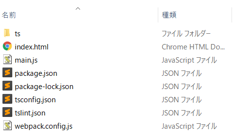

# Electron & React & Redux & TypeScript アプリ作成ワークショップ 4日目

前回はごく簡単な React-Redux を使ったアプリを作りました。

今回から、数回に渡ってより実践的なアプリを作ってみましょう。

## 作成するアプリの仕様

ToDoを管理するアプリを作成します。画面仕様はこんな感じです。


この画面のイベントとしては、下記があります。

* タスク一覧の表示
* タスクの追加
* タスクの完了・未完了の切り替え
* タスクの削除

## プロジェクトの準備

空のディレクトリを作成し、前回作成したチュートリアルのファイルをコピーします。

dist と node_modules は対象外とします。



新しいディレクトリで VSCode を開いて、書きを行います。

* pachage.json を開いて、プロジェクトの名前を変更します。
* ターミナルで`npm install`を実行して、ライブラリをインストールします。

ts ディレクトリ以下の下記ファイルを削除します。ディレクトリは残しておいてください。

```bat
ts
│
├─actions
│      UserEvents.ts // 削除
│
├─components
│      TextBox.tsx // 削除
│      UserForm.tsx // 削除
│
├─reducers
│      UserReducer.ts // 削除
│
└─states
        IUser.ts // 削除
```

## 子ステート定義の作成

Reduxで管理するデータの定義を作成します。

TODOですので、idと、タスクの名前、期限、完了したかどうかのフラグを持ちましょう。

タスクは複数管理されるので、その配列を保持するインターフェイスも定義しておきます。

また、ステートの初期値も定義しておきます。

ITask.ts を作成します。

ts/states/ITask.ts

```ts
export interface ITask {
    id: string;
    complete: boolean;
    deadline: Date;
    todo: string;
}

export interface ITaskList {
    tasks: ITask[];
}

export const initTaskList: ITaskList = {
    tasks: [],
};
```

## ステートへの登録

ステートの定義に、タスクの小ステートを追加します。

以前あった、 IUser は削除してください、

ts/Store.ts
```ts
import {combineReducers, createStore} from 'redux';
import { ITaskList } from './states/ITask';

/**
 * store のデータ型を定義する。（親state）
 *
 * プロパティには、管理する child_state を指定する
 */
export interface IState {
    taskList: ITaskList;
    // state が増えたら足していく
}
// 以下省略
```

下の方で、 Reducer がエラーになっていますが、新しい Reducer を作成したときに修正することにします。

## アクション定義の作成

画面のイベントをアクションとして作成していきます。

今回 Action Creator は、別ファイルに作成します。理由は後ほど非同期アクションについての説明の中で書きます。

action/TodoActions.ts ファイルを作成し、画面のイベントごとにアクション・タイプとアクションを定義します。

ts/action/TodoActions.ts

```ts
import { Action } from 'redux';
import { v4 as UUID } from 'uuid'; // -- (a)
import { ITask } from '../states/ITask';

/**
 * タスクの一覧を表示するアクションタイプ
 */
export const SHOW_TASKS = UUID();
/**
 * タスクの一覧を表示するアクション
 */
export interface IShowTaskAction extends Action {
    tasks: ITask[];
}
/**
 * タスクを追加するアクションタイプ
 */
export const ADD_TASK = UUID();
/**
 * タスクを追加するアクション
 */
export interface IAddTaskAction extends Action {
    deadline: Date;
    taskName: string;
}
/**
 * タスク完了のアクションタイプ
 */
export const TOGGLE_COMPLETE_TASK = UUID();

/**
 * タスク完了のアクション
 */
export interface IToggleCompleteAction extends Action {
    taskId: string;
}

/**
 * タスク削除のアクションタイプ
 */
export const DELETE_TASK = UUID();

/**
 * タスク削除のアクション
 */
export interface IDeleteAction extends Action {
    taskId: string;
}
```

actions/TaskActionCreators.ts ファイルを作成し、アクション・クリエイターを作成します。

ts/actions/TaskActionCreators.ts

```ts
import { ActionCreator } from 'redux';

import { ITask } from '../states/ITask';
import {
    ADD_TASK,
    DELETE_TASK,
    IAddTaskAction,
    IDeleteAction,
    IShowTaskAction,
    IToggleCompleteAction,
    SHOW_TASKS,
    TOGGLE_COMPLETE_TASK,
} from './TaskActions';

/**
 * タスクの表示アクションを作成する
 * @param tasks 表示するタスクのリスト
 */
export const creatShowTasksAction: ActionCreator<IShowTaskAction>
    = (tasks: ITask[]) => {
        return {
            tasks,
            type: SHOW_TASKS,
        };
    };
/**
 * 新しいタスクを作成するアクションを作成する
 * @param taskName 新しいタスクの名前
 * @param deadline 新しいタクスの期限
 */
export const createAddTaskAction: ActionCreator<IAddTaskAction>
    = (taskName: string, deadline) => {
        return {
            deadline,
            taskName,
            type: ADD_TASK,
        };
    };
/**
 * タスクの完了状態を切り替える
 * @param taskId 完了状態を切り替える対象のタスクのID
 */
export const createToggleCompleteAction: ActionCreator<IToggleCompleteAction>
    = (taskId: string) => {
        return {
            taskId,
            type: TOGGLE_COMPLETE_TASK,
        };
    };
/**
 * タスクを削除するアクションを作成する
 * @param taskId 削除するタスクのID
 */
export const createDeleteTaskAction: ActionCreator<IDeleteAction>
    = (taskId: string) => {
        return {
            taskId,
            type: DELETE_TASK,
        };
    };
```

## Reducer の作成

作成したアクション毎の Reducer の処理を書いていきます。

前回は、アクション・タイプ を switch で分岐して処理を書いていましたが、アクションが多くなると、Reducer の関数が長くなりすぎて、コードも見にくいですし、メンテナンスしづらくなります。

そこで、事前にアクション・タイプとそれ毎の処理を登録し、アクション・タイプを渡すと、その処理を実行するクラスを作っておきましょう。

このクラスは、新しいディレクトリ utils を作成して、その中に作成します。

ts/utils/ActionToReducerMapper.ts
```ts
```